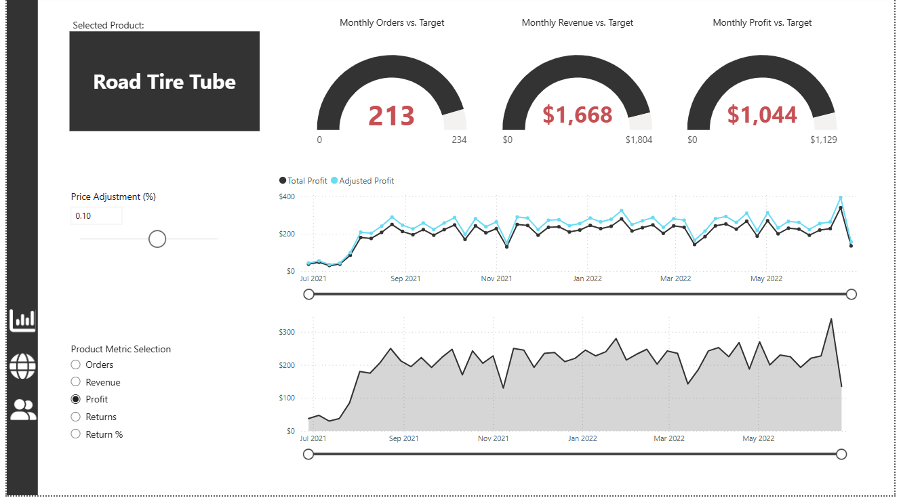

# sales_performance_dashboard_PowerBI
Interactive Power BI dashboard that helps track KPIs and product-level details

1. The goal of this project was to track the sales performance and various related metrics.
2. Star-Schema model was used to integrate Product, Customer dimensions with the fact table.
3. DAX Measures were used to calculate Indicators like Total Revenue, Total Profit, Return Rate, Average Revenue Per Customer etc.
4. Gauge Chart, KPI cards highlight key metrics, and Line and Area charts were used to show trends.
5. A geographic map was included to display and analyse sales by region.
6. Drill-Down analysis was used to identify for individual product analysis.

